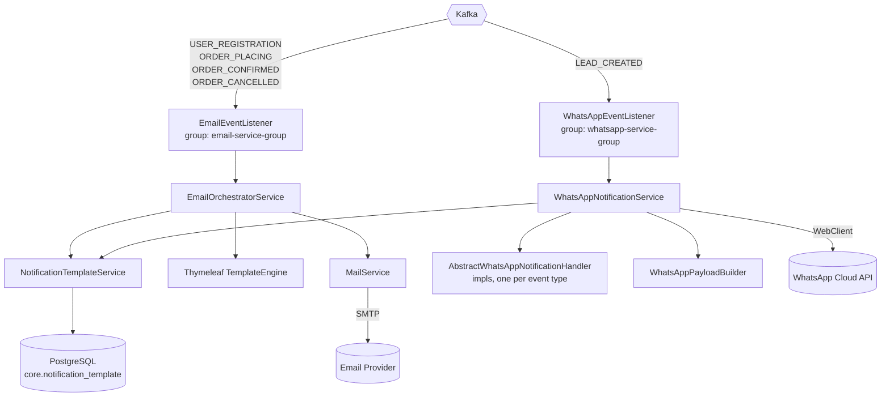

# MercadoX Email & Notification Service

## Overview

`mercado-x-email` is the notification hub of the MercadoX ecosystem. It owns zero domain state of its own — no orders, no users — and exists purely to react to events published by other services (`mercado-x-core`, `mercado-x-oauth`) and deliver them to humans over email (SMTP) and WhatsApp (Meta Cloud API).

It is entirely Kafka-driven: nothing calls this service synchronously except the admin-facing template management endpoint.

---

## Prerequisites

- Java 17
- Maven 3.8+
- Docker and Docker Compose
- Access to the GitHub Packages registry for `hn.shadowcore` internal libraries
- SMTP credentials (e.g. a Gmail app password) for outbound email
- A WhatsApp Business (Meta Cloud API) token — a mock value works fine for local dev

---

## Quick Start

### 1. Start infrastructure

From the repo root:

```bash
docker-compose up -d
```

This starts PostgreSQL (5432), Redis (6379), Kafka (9092), Zookeeper, and Schema Registry (8085).

### 2. Initialize the database schema

Schema is owned by `mercado-x-library-jpa`:

```bash
docker exec -i mercadox-postgres psql -U postgres -d mercado_x < /path/to/mercado-x-library-jpa/src/main/resources/schema.sql
```

### 3. Provide the JWT verification key

Same as `mercado-x-core` — this service only needs `mercado-x-oauth`'s **public** key to verify tokens locally:

```bash
mkdir -p secrets
cp /path/to/mercado-x-oauth/secrets/public.pem secrets/public.pem
```

### 4. Configure environment

| Variable | Default | Description |
|---|---|---|
| `DB_USERNAME` | `postgres` | PostgreSQL username |
| `DB_PASSWORD` | — | PostgreSQL password |
| `MAIL_USERNAME` | — | SMTP username |
| `MAIL_PASSWORD` | — | SMTP password / app password |
| `WHATSAPP_API_BASE_URL` | `https://graph.facebook.com/v20.0/mock-phone-id` | Meta Cloud API base URL |
| `WHATSAPP_API_TOKEN` | `mock-token` | Meta Cloud API access token |
| `KAFKA_BOOTSTRAP_SERVERS` | `localhost:9092` | Kafka bootstrap servers |
| `JWT_PUBLIC_KEY_LOCATION` | `file:./secrets/public.pem` | Path to the oauth service's RSA public key |

### 5. Run the service

```bash
mvn spring-boot:run
```

The service starts on `http://localhost:8085`.

---

## Architecture



Both listener paths share one `NotificationTemplate` table (`TemplateChannel.EMAIL` / `TemplateChannel.WHATSAPP`), so template content is managed in one place regardless of delivery channel.

### Kafka consumers

| Listener | Topic | Consumer group | Trigger |
|---|---|---|---|
| `EmailEventListener.handleUserRegistered` | `user.registration.validation` | `email-service-group` | `mercado-x-oauth` registration |
| `EmailEventListener.handleOrderPlaced` | `order.operation.place` | `email-service-group` | `mercado-x-core` order placement |
| `EmailEventListener.handlerOrderConfirmed` | `order.operation.confirm` | `email-service-group` | `mercado-x-core` order dispatch |
| `EmailEventListener.handleOrderCancelled` | `order.operation.cancelled` | `email-service-group` | `mercado-x-core` order cancellation |
| `WhatsAppEventListener.handleLeadCreation` | `lead.created.v1` | `whatsapp-service-group` | `mercado-x-core` lead capture |

Every listener is annotated `@KafkaIdempotent`, which routes through `KafkaIdempotencyAspect` (in `mercado-x-context`) to skip events whose `eventId` has already been processed — Kafka's at-least-once delivery means the same order-confirmation event can be redelivered after a consumer restart, and this stops it from emailing the customer twice.

### Notification handler pattern (WhatsApp)

New WhatsApp-triggered event types are added by implementing `AbstractWhatsAppNotificationHandler<T extends DomainEvent>` (see `LeadWelcomeWhatsAppHandler`) and registering it as a `@Component` — `WhatsAppNotificationService` picks up all implementations via `List<AbstractWhatsAppNotificationHandler<?>>` injection and dispatches by event class, so adding a new WhatsApp notification never touches the dispatch service itself.

---

## API Surface

| Method | Path | Auth | Description |
|---|---|---|---|
| `POST` | `/api/v1/templates` | `ROLE_ADMIN` | Create a notification template (email or WhatsApp) |

This is the only synchronous entry point into the service — everything else is Kafka-driven.

---

## Configuration Reference

```yaml
server:
  port: 8085

spring:
  mail:
    host: smtp.gmail.com
    port: 587
    username: ${MAIL_USERNAME}
    password: ${MAIL_PASSWORD}
  kafka:
    bootstrap-servers: ${KAFKA_BOOTSTRAP_SERVERS:localhost:9092}
    consumer:
      group-id: email-service-group
    listener:
      missing-topics-fatal: false

whatsapp:
  api:
    base-url: ${WHATSAPP_API_BASE_URL:https://graph.facebook.com/v20.0/mock-phone-id}
    token: ${WHATSAPP_API_TOKEN:mock-token}
```

---

## Running Tests

```bash
mvn test
```

---

## Internal Dependencies

| Module | Purpose |
|---|---|
| `mercado-x-library-jpa` | `NotificationTemplate` entity/repository, master schema |
| `mercado-x-context` | JWT verification, org-tenant context, `@KafkaIdempotent` aspect |
| `mercado-x-oauth` | JWT verification filter chain (compile-time only — no runtime calls) |

---

## Roadmap / Known Limitations

This service currently assumes a single WhatsApp Business Account (credentials are one process-wide `WebClient` bean) and its `KafkaIdempotencyAspect` performs a non-atomic check-then-mark against Redis, which leaves a narrow window for duplicate processing under concurrent delivery of the same event. Both are tracked, along with the rest of the prioritized backlog (dead-letter handling for malformed events, WebClient error mapping, request validation), in [`TODO.md`](../TODO.md) at the repo root.
