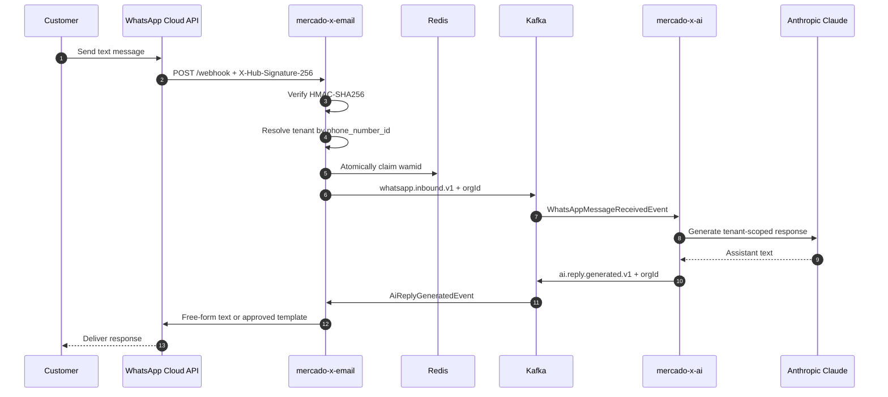
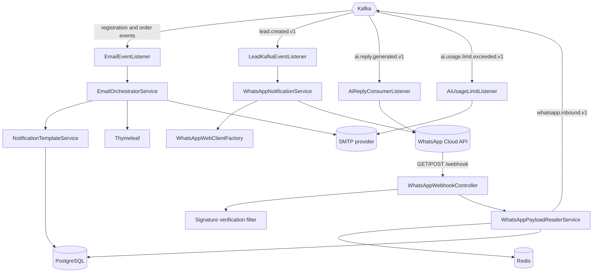

# MercadoX Email & Messaging Service

## Overview

`mercado-x-email` is the external communications gateway for the MercadoX ecosystem. It reacts to Kafka events and delivers email or WhatsApp notifications, and it owns the WhatsApp webhook boundary used by the MercadoX AI assistant.

The service deliberately contains no commerce or AI reasoning logic. Its responsibilities are channel-specific:

- Render and send transactional email through SMTP.
- Render and send WhatsApp templates through the Meta Cloud API.
- Authenticate inbound Meta webhooks and translate customer text into Kafka events.
- Deliver AI-generated replies received from `mercado-x-ai`.
- Notify organization administrators when their monthly AI usage limit is reached.

Except for template administration and Meta's webhook, service-to-service work is asynchronous and Kafka-driven.

---

## WhatsApp AI Workflow



The email service is the anti-corruption layer around Meta. `mercado-x-ai` never needs to understand webhook envelopes, HMAC signatures, WhatsApp message IDs, or Cloud API delivery responses.

### Inbound webhook safeguards

- `GET /webhook` handles Meta's one-time verification challenge.
- Every `POST /webhook` is checked against `X-Hub-Signature-256` using HMAC-SHA256 and a constant-time comparison.
- Status receipts and unsupported message types are ignored; the AI workflow currently accepts text messages.
- The incoming `phone_number_id` resolves `OrganizationWhatsAppConfig`, establishing the tenant before Kafka publishing.
- Meta's stable `wamid` is atomically claimed in Redis for 24 hours to suppress webhook retries.
- The published event carries `orgId` in both its Avro payload and Kafka header.

### Outbound AI replies

`AiReplyConsumerListener` consumes `ai.reply.generated.v1` in `whatsapp-service-group`:

- `FREEFORM` sends text during WhatsApp's active customer-service window.
- `TEMPLATE` loads the organization's configured re-engagement template for delivery outside that window.

The listener is `@KafkaIdempotent`, preventing the same generated reply from being sent twice after Kafka redelivery.

---

## Architecture



Email and WhatsApp template delivery share the `NotificationTemplate` model, separated by `TemplateChannel.EMAIL` and `TemplateChannel.WHATSAPP`.

---

## Kafka Consumers

| Listener | Topic | Consumer group | Trigger / action |
|---|---|---|---|
| `EmailEventListener.handleUserRegistered` | `user.registration.validation` | `email-service-group` | Send registration email |
| `EmailEventListener.handleOrderPlaced` | `order.operation.place` | `email-service-group` | Send order-placement email |
| `EmailEventListener.handleOrderConfirmed` | `order.operation.confirm` | `email-service-group` | Send order-confirmation email |
| `EmailEventListener.handleOrderCancelled` | `order.operation.cancelled` | `email-service-group` | Send order-cancellation email |
| `LeadKafkaEventListener.handleLeadCreation` | `lead.created.v1` | `whatsapp-service-group` | Send tenant-configured lead welcome template |
| `AiReplyConsumerListener.handleAiReply` | `ai.reply.generated.v1` | `whatsapp-service-group` | Deliver Claude response over WhatsApp |
| `AiUsageLimitListener.handleUsageLimitExceeded` | `ai.usage.limit.exceeded.v1` | `email-service-group` | Email the tenant administrator once per billing cycle |

Every consumer uses `@KafkaIdempotent`. Tenant-aware email listeners also use `@KafkaOrgIdPropagated` to restore the organization context carried in Kafka headers.

---

## WhatsApp Notification Handler Pattern

Event-driven WhatsApp templates implement `AbstractWhatsAppNotificationHandler<T extends SpecificRecord>`. For example, `LeadWelcomeWhatsAppHandler` translates a `LeadCreatedEvent` into a `NotificationRequest`.

`WhatsAppNotificationService` discovers handlers through Spring injection, resolves `OrganizationWhatsAppConfig` from the request's `orgId`, creates a tenant-specific Meta client with `WhatsAppWebClientFactory`, renders the matching template, and validates Meta's delivery response. Adding a new template notification does not require changing the dispatch service.

---

## API Surface

| Method | Path | Auth | Description |
|---|---|---|---|
| `GET` | `/webhook` | Meta verify token | Complete Meta webhook registration challenge |
| `POST` | `/webhook` | Meta HMAC signature | Receive and enqueue inbound WhatsApp messages |
| `POST` | `/api/v1/templates` | `ROLE_ADMIN` | Create an email or WhatsApp notification template |
| `GET` | `/swagger-ui.html` | Public | OpenAPI documentation UI |

The webhook is public at the network layer but authenticated by Meta's signature rather than a MercadoX JWT. Other application endpoints remain stateless and JWT-protected.

---

## Prerequisites

- Java 17
- Maven 3.8+
- Docker and Docker Compose
- Access to the `hn.shadowcore` packages in GitHub Packages
- PostgreSQL, Redis, Kafka, and Confluent Schema Registry
- SMTP credentials for outbound email
- Meta WhatsApp Business credentials for webhook verification and delivery
- The MercadoX OAuth public key for local JWT verification

---

## Quick Start

### 1. Start infrastructure

From the `mercado-x-email` directory inside the local MercadoX workspace:

```bash
docker compose -f ../docker-compose.yaml up -d
```

This starts the shared development infrastructure, including PostgreSQL, Redis, Kafka, and Schema Registry.

### 2. Initialize the database schema

The canonical schema is owned by `mercado-x-library-jpa`:

```bash
docker exec -i mercadox-postgres psql -U postgres -d mercado_x < /path/to/mercado-x-library-jpa/src/main/resources/schema.sql
```

### 3. Provide the JWT verification key

Only `mercado-x-oauth` holds the private key. This service needs its public key:

```bash
mkdir -p secrets
cp /path/to/mercado-x-oauth/secrets/public.pem secrets/public.pem
```

### 4. Configure the environment

| Variable | Default | Description |
|---|---|---|
| `DB_URL` | `jdbc:postgresql://localhost:5432/mercado_x` | PostgreSQL JDBC URL |
| `DB_USERNAME` | `postgres` | PostgreSQL username |
| `DB_PASSWORD` | — | PostgreSQL password |
| `MAIL_USERNAME` | — | SMTP username |
| `MAIL_PASSWORD` | — | SMTP password or app password |
| `KAFKA_BOOTSTRAP_SERVERS` | `localhost:9092` | Kafka bootstrap servers |
| `SCHEMA_REGISTRY_URL` | `http://localhost:8085` | Confluent Schema Registry URL |
| `JWT_PUBLIC_KEY_LOCATION` | `file:./secrets/public.pem` | OAuth RSA public key |
| `WHATSAPP_GRAPH_BASE_URL` | `https://graph.facebook.com/v20.0` | Base URL used by tenant-specific WhatsApp clients |
| `WHATSAPP_VERIFY_TOKEN` | `placeholder-verify-token` | Meta webhook challenge token |
| `WHATSAPP_APP_SECRET` | `placeholder-app-secret` | Secret used to verify webhook HMAC signatures |
| `WHATSAPP_API_BASE_URL` | Meta mock URL | Legacy/shared outbound client base URL |
| `WHATSAPP_API_TOKEN` | `mock-token` | Legacy/shared outbound client token |

Per-organization `phoneNumberId`, access token, AI enablement, plan, overage policy, and re-engagement template live in `OrganizationWhatsAppConfig`.

### 5. Run the service

```bash
mvn spring-boot:run
```

The service starts on `http://localhost:8082`.

---

## Running Tests

```bash
mvn test
```

The suite covers email and WhatsApp event consumers, webhook signature validation, webhook deduplication and parsing, tenant client routing, payload rendering, Meta API error mapping, Kafka dead-letter behavior, and AI reply delivery.

---

## Internal Dependencies

| Module | Purpose |
|---|---|
| `mercado-x-library-entity` | Notification DTOs, webhook payloads, Avro contracts, and shared entities (transitive through JPA) |
| `mercado-x-library-jpa` | Notification, organization, user, and WhatsApp configuration repositories |
| `mercado-x-context` | JWT verification, tenant context, Kafka propagation, idempotency, and Redis support |
| `mercado-x-oauth` | JWT verification filter chain at compile time; no runtime token-introspection call |

---

## Current Scope and Roadmap

The lead-template path now resolves tenant-specific WhatsApp clients. The AI free-form and re-engagement reply path still uses the shared `whatsAppWebClient`; it should be migrated to `WhatsAppWebClientFactory` before enabling multiple WhatsApp Business accounts in production.

Other production priorities include end-to-end dead-letter recovery for malformed events and external provider failures, credential rotation and cache eviction, delivery observability, and request validation. See the project backlog for the remaining hardening work.
